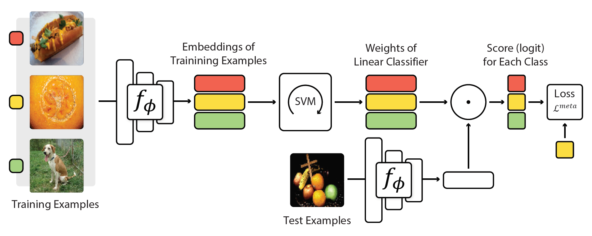

# Meta-Learning with Differentiable Convex Optimization
This repository contains the code for the paper:
<br>
[**Meta-Learning with Differentiable Convex Optimization**](https://arxiv.org/pdf/1904.03758.pdf)
<br>
Kwonjoon Lee, [Subhransu Maji](https://people.cs.umass.edu/~smaji/), Avinash Ravichandran, [Stefano Soatto](http://web.cs.ucla.edu/~soatto/)   
CVPR 2019 (**Oral**)
<p align='center'>
  
</p>

### Abstract

Many meta-learning approaches for few-shot learning rely on simple base learners such as nearest-neighbor classifiers. However, even in the few-shot regime, discriminatively trained linear predictors can offer better generalization. We propose to use these predictors as base learners to learn representations for few-shot learning and show they offer better tradeoffs between feature size and performance across a range of few-shot recognition benchmarks. Our objective is to learn feature embeddings that generalize well under a linear classification rule for novel categories. To efficiently solve the objective, we exploit two properties of linear classifiers: implicit differentiation of the optimality conditions of the convex problem and the dual formulation of the optimization problem. This allows us to use high-dimensional embeddings with improved generalization at a modest increase in computational overhead. Our approach, named MetaOptNet, achieves state-of-the-art performance on miniImageNet, tieredImageNet, CIFAR-FS and FC100 few-shot learning benchmarks.

### Citation

If you use this code for your research, please cite our paper:
```
@inproceedings{lee2019meta,
  title={Meta-Learning with Differentiable Convex Optimization},
  author={Kwonjoon Lee and Subhransu Maji and Avinash Ravichandran and Stefano Soatto},
  booktitle={CVPR},
  year={2019}
}
```

## Dependencies
* Python 2.7+ (not tested on Python 3)
* [PyTorch 0.4.0+](http://pytorch.org)
* [qpth 0.0.11+](https://github.com/locuslab/qpth)
* [tqdm](https://github.com/tqdm/tqdm)

## Usage

### Installation

1. Clone this repository:
    ```bash
    git clone https://github.com/kjunelee/MetaOptNet.git
    cd MetaOptNet
    ```
2. Download and decompress dataset files: [**miniImageNet**](https://drive.google.com/file/d/12V7qi-AjrYi6OoJdYcN_k502BM_jcP8D/view?usp=sharing) (courtesy of [**Spyros Gidaris**](https://github.com/gidariss/FewShotWithoutForgetting)), [**tieredImageNet**](https://drive.google.com/open?id=1nVGCTd9ttULRXFezh4xILQ9lUkg0WZCG), [**FC100**](https://drive.google.com/file/d/1_ZsLyqI487NRDQhwvI7rg86FK3YAZvz1/view?usp=sharing), [**CIFAR-FS**](https://drive.google.com/file/d/1GjGMI0q3bgcpcB_CjI40fX54WgLPuTpS/view?usp=sharing)

3. For each dataset loader, specify the path to the directory. For example, in MetaOptNet/data/mini_imagenet.py line 30:
    ```python
    _MINI_IMAGENET_DATASET_DIR = 'path/to/miniImageNet'
    ```

### Meta-training
1. To train MetaOptNet-SVM on 5-way miniImageNet benchmark:
    ```bash
    python train.py --gpu 0,1,2,3 --save-path "./experiments/miniImageNet_MetaOptNet_SVM" --train-shot 15 \
    --head SVM --network ResNet --dataset miniImageNet --eps 0.1
    ```
    As shown in Figure 2, of our paper, we can meta-train the embedding once with a high shot for all meta-testing shots. We don't need to meta-train with all possible meta-test shots unlike in Prototypical Networks.
2. You can experiment with varying base learners by changing '--head' argument to ProtoNet or Ridge. Also, you can change the backbone architecture to vanilla 4-layer conv net by setting '--network' argument to ProtoNet. For other arguments, please see MetaOptNet/train.py from lines 85 to 114.
3. To train MetaOptNet-SVM on 5-way tieredImageNet benchmark:
    ```bash
    python train.py --gpu 0,1,2,3 --save-path "./experiments/tieredImageNet_MetaOptNet_SVM" --train-shot 10 \
    --head SVM --network ResNet --dataset tieredImageNet
    ```
3. To train MetaOptNet-RR on 5-way CIFAR-FS benchmark:
    ```bash
    python train.py --gpu 0 --save-path "./experiments/CIFAR_FS_MetaOptNet_RR" --train-shot 5 \
    --head Ridge --network ResNet --dataset CIFAR_FS
    ```
4. To train MetaOptNet-RR on 5-way FC100 benchmark:
    ```bash
    python train.py --gpu 0 --save-path "./experiments/FC100_MetaOptNet_RR" --train-shot 15 \
    --head Ridge --network ResNet --dataset FC100
    ```
### Meta-testing
1. To test MetaOptNet-SVM on 5-way miniImageNet 1-shot benchmark:
```
python test.py --gpu 0,1,2,3 --load ./experiments/miniImageNet_MetaOptNet_SVM/best_model.pth --episode 1000 \
--way 5 --shot 1 --query 15 --head SVM --network ResNet --dataset miniImageNet
```
2. Similarly, to test MetaOptNet-SVM on 5-way miniImageNet 5-shot benchmark:
```
python test.py --gpu 0,1,2,3 --load ./experiments/miniImageNet_MetaOptNet_SVM/best_model.pth --episode 1000 \
--way 5 --shot 5 --query 15 --head SVM --network ResNet --dataset miniImageNet
```

## Acknowledgments

This code is based on the implementations of [**Prototypical Networks**](https://github.com/cyvius96/prototypical-network-pytorch),  [**Dynamic Few-Shot Visual Learning without Forgetting**](https://github.com/gidariss/FewShotWithoutForgetting), and [**DropBlock**](https://github.com/miguelvr/dropblock).
